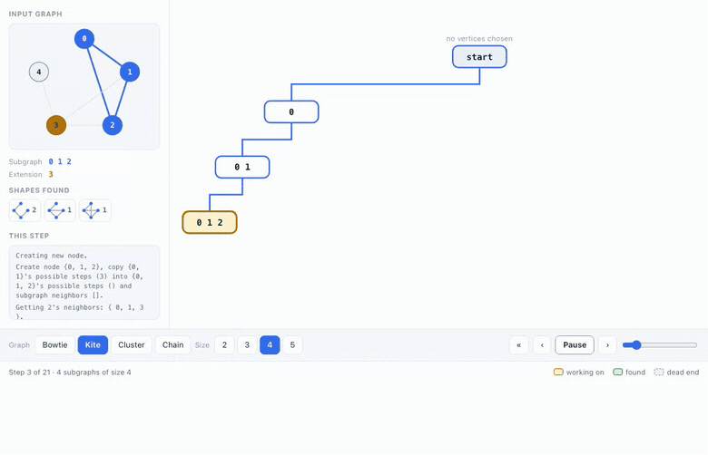

# ESU Algorithm Visualizer

A desktop app that shows, one step at a time, how the **ESU algorithm** finds
every connected subgraph of a given size in a graph.

ESU — *Enumerate SUbgraphs*, from Sebastian Wernicke's work on network motifs —
answers a question that matters in biology: which small wiring patterns show up
in a network more often than chance would explain? Finding those patterns means
enumerating every connected subgraph of size *k*, exactly once each. ESU does
that with a labelling rule that stops the same subgraph being discovered twice.

The rule is easy to state and hard to picture, which is what this app is for.
It draws the graph and the search tree side by side: as you step, the subgraph
being built lights up in the graph, the tree grows a box for it, and the step
log says why the algorithm accepted or rejected each candidate.

**[Try it in your browser →](https://lolodawit.github.io/ESU-Algorithm/)** — no install,
the algorithm runs client-side.



## Running it

You need **JDK 21**. Nothing else — the Gradle wrapper fetches Gradle, and
Gradle fetches JavaFX.

```bash
git clone https://github.com/loloDawit/ESU-Algorithm.git
cd ESU-Algorithm
./gradlew run
```

On macOS, `brew install openjdk@21` will get you the JDK. Check what you have
with `java -version`.

## Using it

**Open graph** loads a file, or **Random** generates one and runs it straight
away. Then press **Play**, or step with the arrows.

| Control | What it does |
|---|---|
| **Open graph** | Load a graph file. Opens in `samples/` |
| **Random** | Generate a random connected graph, save it to `samples/random-graph.txt`, and run it |
| **Subgraph size** | How many vertices a subgraph must have, 2–6 |
| **Play** | Step automatically, at the speed set bottom right |
| **‹ ›** | One step back or forward |
| **« »** | Jump to the start or to the finished tree |
| **Fit**, **+ −**, slider | Zoom |
| **Save results** | Write the subgraphs found to a text file |

### Reading the picture

**Left**, the graph you loaded. The subgraph being built is blue; the vertices
it could add next are amber.

**Right**, the search tree. Each box is one subgraph, written as its vertices,
and the line down to it is the choice that produced it. The path from **start**
down to the current box is drawn in blue, so you can see how any subgraph was
reached. **start** is the empty beginning, before any vertex is chosen.

| Box | Meaning |
|---|---|
| Amber | the step being performed right now |
| Green | reached the requested size — an actual result |
| Grey, dashed | dead end: the branch ran out of valid vertices |
| White | still expanding |

The **Subgraph** and **Extension** lines under the graph give the same two sets
in full for the current step, and **This step** below them is the algorithm's
own commentary. Clicking one of its lines traces that node back to the start.

## Graph file format

A plain text file, one edge per line, two whitespace-separated integers:

```
0 1
0 2
1 2
2 3
2 4
3 4
```

Vertices are 0-based integers. Edges are undirected, so `0 1` and `1 0` mean the
same thing. Directed and weighted graphs are not supported.

Four graphs ship in `samples/`:

| File | Vertices | Shape |
|---|---|---|
| `sample-small.txt` | 8 | Good starting point: two triangles, a bridge, a tail |
| `cluster.txt` | 7 | A dense 4-clique plus a triangle — more branching |
| `bowtie.txt` | 5 | Smallest interesting case: two triangles sharing a hub |
| `src/main/resources/esu/algorithm/myGraph.txt` | 15 edges | Larger, sparser: vertex ids up to 100 |

## How the code is laid out

```
src/main/java/esu/algorithm/
├── UndirectedGraph.java    adjacency matrix, reads graph files
├── EsuNode.java            one node of the search tree; does the real work
├── EsuTree.java            the tree; step() advances the algorithm once
├── StepInfo.java           a log entry describing one step
├── EsuSession.java         one run, positioned at a step
├── RandomGraph.java        random connected graph generation
└── ui/                     JavaFX front end
    ├── EsuApp.java         the window
    ├── GraphPanel.java     the input graph, with the subgraph highlighted
    ├── TreeLayout.java     where every box goes
    └── TreeRenderer.java   turning that into shapes
```

The split matters: everything outside `ui/` is plain Java with no JavaFX
dependency, so the algorithm can be tested and reused on its own.
`EsuTree.step()` advancing exactly one step is what makes pause-and-step
possible.

`EsuSession` holds a run and where you are in it. Rather than keeping a copy of
the tree after every step, it reaches a step by replaying the algorithm —
enumerating from scratch is fast enough that re-running beats remembering, and
it holds two trees instead of hundreds. `TreeLayout` has no JavaFX reference
either, so the geometry is tested directly.

## The browser version

`web/` is a TypeScript port of the engine and the views, which is what runs on
the project page. The desktop app stays the reference implementation.

It is held to the Java's behaviour rather than merely its results:
`web/test/java-golden.json` is generated by the Java engine and records which
node every single step builds, so a port that found the right subgraphs by a
different route fails. See `web/README.md`.

## Tests

```bash
./gradlew test
```

The algorithm is checked against a brute-force oracle: enumerate every *k*-subset
of vertices, keep the connected ones, and require ESU to return exactly that set
with no duplicates. That runs across several graphs and sizes.

Two other things are worth testing and are: that a step reached by replay is
identical to one reached by stepping, and that the tree layout puts parents over
their children without overlapping anything.

Both front ends are covered too. The JavaFX views are built for real, styled,
and inspected without showing a window. The demo is run in Chromium against the
published page, which is the only thing here that can see size, position and
colour.

## License

MIT — see [LICENSE](LICENSE).
