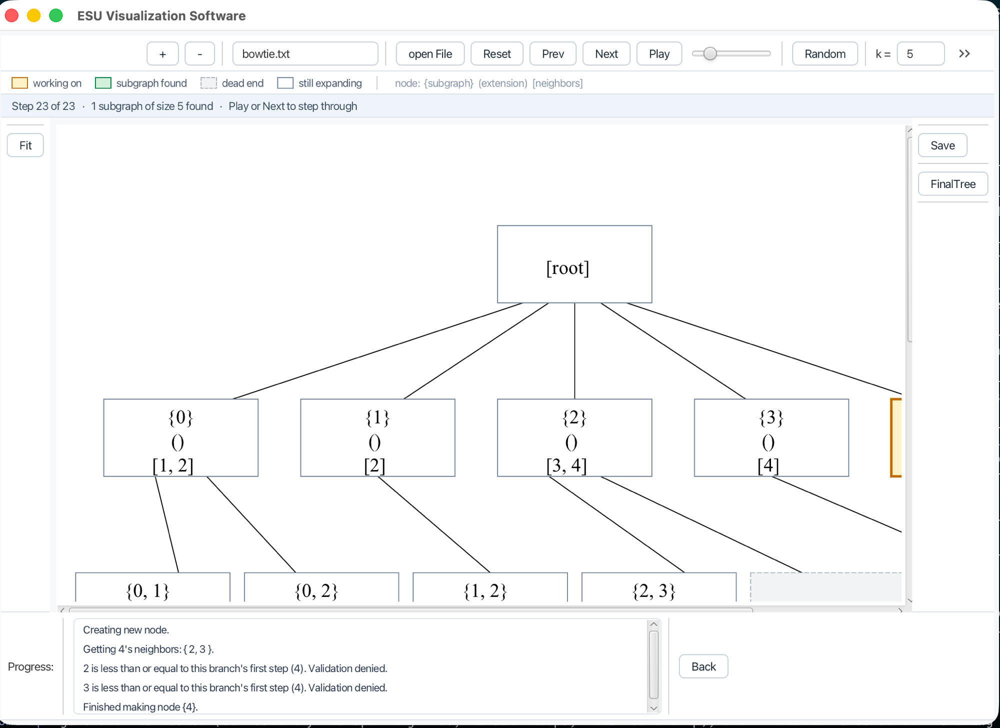

# ESU Algorithm Visualizer

A desktop app that shows, one step at a time, how the **ESU algorithm** finds
every connected subgraph of a given size in a graph.

ESU — *Enumerate SUbgraphs*, from Sebastian Wernicke's work on network motifs —
answers a question that matters in biology: which small wiring patterns show up
in a network more often than chance would explain? Finding those patterns means
enumerating every connected subgraph of size *k*, exactly once each. ESU does
that with a labelling rule that stops the same subgraph being discovered twice.

The rule is easy to state and hard to picture, which is what this app is for.
It draws the search tree as it grows, so you can watch a branch get accepted or
rejected and read why in the step log underneath.



## Running it

You need **JDK 21**. Nothing else — the Gradle wrapper fetches Gradle, and
Gradle fetches JavaFX.

```bash
git clone https://github.com/loloDawit/ESU-Algorithm.git
cd ESU-Algorithm
./gradlew run
```

On macOS, `brew install openjdk@21` will get you the JDK. Check what you have
with `java -version`.

Run the tests with:

```bash
./gradlew test
```

## Using it

Press **Start Application**, then either **open File** to load a graph, or
**Random** to generate one and run it immediately.

| Control | What it does |
|---|---|
| **open File** | Load a graph. Opens in `samples/` |
| **Random** | Generate a random connected graph, save it to `samples/random-graph.txt`, and run it |
| **k** | Subgraph size to search for, 2–9 |
| **Play** / **Next** / **Prev** | Step through the search, automatically or by hand |
| **FinalTree** | Jump to the finished tree |
| **Fit** | Zoom so the whole tree is visible |
| **+ / − / slider** | Zoom |
| **Save** | Write the subgraphs found to a text file |

Each box in the tree is one node of the search, showing three lines:

```
{0, 1, 2}     the subgraph built so far
(3, 4)        the extension set: vertices still available to add
[5]           neighbours of the subgraph
```

Colour says what happened to that node:

| Colour | Meaning |
|---|---|
| Amber | the step being performed right now |
| Green | reached size *k* — an actual result |
| Grey, dashed | dead end: the branch ran out of valid vertices |
| White | still expanding |

Clicking a line in the step log highlights the node it is talking about.

## Graph file format

A plain text file, one edge per line, two whitespace-separated integers:

```
0 1
0 2
1 2
2 3
2 4
3 4
```

Vertices are 0-based integers. Edges are undirected, so `0 1` and `1 0` mean the
same thing. Directed and weighted graphs are not supported.

Four graphs ship in `samples/`:

| File | Vertices | Shape |
|---|---|---|
| `sample-small.txt` | 8 | Good starting point: two triangles, a bridge, a tail |
| `cluster.txt` | 7 | A dense 4-clique plus a triangle — more branching |
| `bowtie.txt` | 5 | Smallest interesting case: two triangles sharing a hub |
| `ESU Algorithm/src/esu/algorithm/myGraph.txt` | 15 edges | The original 2018 test graph |

## How the code is laid out

```
ESU Algorithm/src/esu/algorithm/
├── UndirectedGraph.java    adjacency matrix, reads graph files
├── ESUNode.java            one node of the search tree; does the real work
├── ESUTree.java            the tree; step() advances the algorithm once
├── StepInfo.java           a log entry describing one step
├── RandomGraph.java        random connected graph generation
└── UI/                     JavaFX front end
```

The split matters: everything outside `UI/` is plain Java with no JavaFX
dependency, so the algorithm can be tested and reused on its own. `ESUTree.step()`
advancing exactly one step is what makes pause-and-step possible.

## Tests

The algorithm is checked against a brute-force oracle: enumerate every *k*-subset
of vertices, keep the connected ones, and require ESU to return exactly that set
with no duplicates. That runs across several graphs and sizes.

## License

MIT — see [LICENSE](LICENSE).
